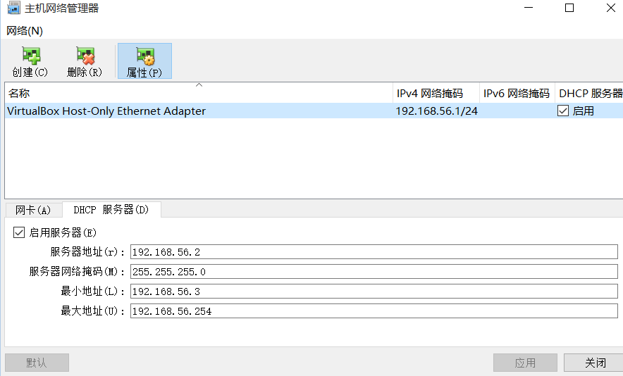
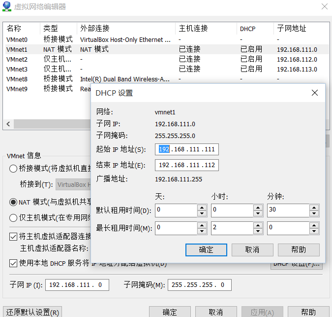

Linux一文通

虚拟机工具：virtual box或者vmware

Linux：debian x64

Virtual box免费，文件体积小，联网固定ip不方便，安装增强功能繁琐。

Vmware收费，联网固定ip方便，安装增强功能方便，体积大。

Linux中Debian耗费资源少，易于使用。安装稍麻烦，root方便不妖。Debian9.4x64在1g内存中会占用200m。linux在镜像网站下载更快。

设定用户名密码 root d ，d d。

1.  安装debian

>   选择debianx64
>   dvd镜像，不接网卡安装，选中ssh，需要桌面的选中桌面。大概十分钟。

1.  联网固定ip

>   虚拟机既要连接外网，也要对主机有一个固定ip。

>   Virtualbox中配置两块网卡，第一块配置nat接外网，第二块配置hostonly，hostonly网卡要已配置dhcp服务。

>   Vmware配置一块nat网卡，nat网卡配置dhcp服务。

>   配置清华镜像源

wget https://rawgit.com/tuna/oh-my-tuna/master/oh-my-tuna.py

>   python oh-my-tuna.py

1.  配置ssh

>   安装linux时选中ssh，文件浏览器或者vi打开/etc/ssh/sshd.conf

>   找到\#PermitRootLogin without-password 修改为PermitRootLogin yes 。

>   命令 ip addr，查看虚拟机ip。

>   使用MobaXterm_Personal
>   ssh连接linux。Mobaxterm是一块完美的连接ssh工具。*https://mobaxterm.mobatek.net/download.html*
>   。可以管理文件，执行命令，多开会话监控，双击文件即可远程编辑。

>   我曾经想要三个linux
>   管理工具:文件管理、任务管理、程序管理。Mobaxterm做到了一个客户端工具所能做到的。Winscp的文件管理突出，命令行弱。

1.  共享文件夹

>   需要上传下载大量文件的时候很有用。

>   Vmware安装增强功能，需要解压缩光盘文件后安装。共享文件后若无显示需要手动挂载。

>   *mount -t vmhgfs .host:/sharing /mnt/hgfs*

>   *vmhgfs-fuse .host:/ /mnt/hgfs*

>   编辑 /etc/fstab，添加下面一行

>   *.host:/shared /mnt/hgfs vmhgfs defaults 0 0 （按需写）*

>   Virtualbox需要先安装依赖。

>   *apt-get install build-essential*

>   *apt-get install linux-headers-\$(uname -r) \#uname –r == 4.9.0-4-amd64
>   内核版本号*

>   *sh /media/cdrom0/VBoxLinuxAdditions.run*

>   共享文件后若无显示手动挂载

>   *mount -t vboxsf share /mnt/shared*

1.  常用命令

>   安装程序： apt-get install gcc ，sh /cmd.run 执行文件

>   切换用户： sudo passwd 设置密码，sudo su 切换为root

>   文件： cd /etc切换文件夹，ls列举文件，rm file移除文件，nano/vi file 编辑文件

>   系统管理：ip addr 查看ip，free内存占用，top任务占用

已经制作好的几个ova，链接：https://pan.baidu.com/s/1eJpkLzkBTQqAW-6JPrErwg
密码：zwd0
